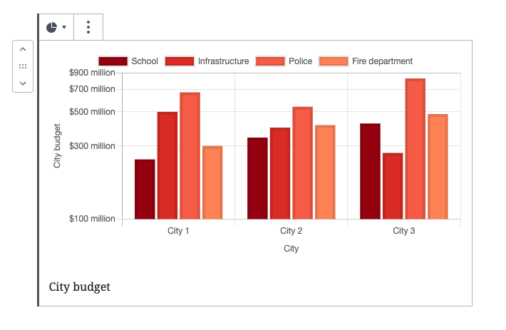

# Data Visualization Gutenberg Block



A minimalist Gutenberg block plugin for adding data vizualisation to your WordPress blog posts. Learn more [on fourtonfish.com](https://fourtonfish.com/project/data-visualization-gutenberg-block/).

## Development

```sh
#install dependencies
npm install
# build admin scripts
npm run build # or npm run start to watch for changes
# build front-end scripts
gulp
```
